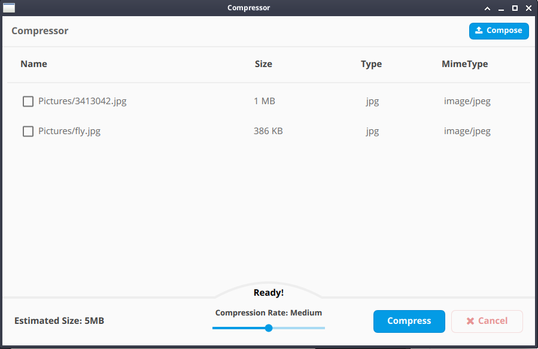
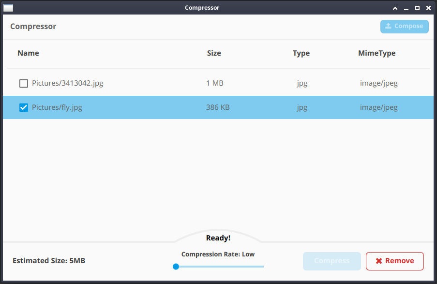

# Mini Archive Compressor (CPP)

C++  software to compress and archive files with Qt based UI. (Currently user-interface ready)

Project not complete and we need to a good compression algorithm... (Development)

**Are you interested?**

## Similar Projects

- https://github.com/BaseMax/MiniPHPArchiveCompressor
- https://github.com/BaseMax/ZMiniCArchiveCompressor

### Dependency

- C++
- Qt, Qt Creator

Tested on: Qt 5.12, 5.14 with Qt Creator 4.12.0

### Authors

- Inspired from SearchKing Team designs
- Thanks to [SeedPuller](https://github.com/SeedPuller) for helping design and developing this project (Design)

Maintained by Max Base

---------

# Max Base

My nickname is Max, Programming language developer, Full-stack programmer. I love computer scientists, researchers, and compilers. ([Max Base](https://maxbase.org/))

## Asrez Team

A team includes some programmer, developer, designer, researcher(s) especially Max Base.

[Asrez Team](https://www.asrez.com/)
